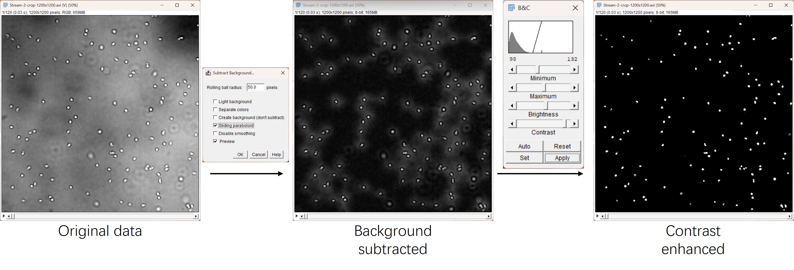
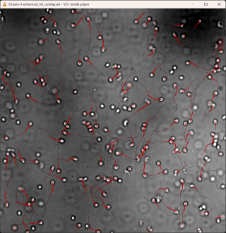

# 🚀 Sperm Motility Analyzer

**Automated detection, tracking, and quantitative analysis of sperm motility using motion-aware algorithms**

[](https://python.org)
[](https://opencv.org)
[](https://opensource.org/licenses/MIT)

---

## 📘 Full parameter reference

### Click here to see ➡️ [Detailed parameter description](docs/Parameters.md) 📖

---

## 🏃‍♂️ Quick Start

### Installation

This pipeline is **recommended for Linux (including WSL)**, and is also supported on **Windows and macOS**, provided **Python ≥ 3.12** is available.

You may use **any terminal**:

* Windows: PowerShell
* Linux: Terminal
* macOS: Terminal

Ensure Python 3 is installed, then install **uv**, which is used for environment management and execution
*(this step is required only once)*:

```bash
pip install uv
```

Clone the repository and set up the environment:

```bash
# Change to your preferred software directory
cd /home/elemeng/software

# Clone the repository
git clone https://github.com/elemeng/simple-sperm-analyzer
cd simple-sperm-analyzer

# Install dependencies
uv sync

# Activate the virtual environment
source .venv/bin/activate   # On Windows: .venv\Scripts\activate
```

✅ **The pipeline is now ready to run.**

---

## 🔎 Basic Usage

```bash
# Show help message
uv run src/main.py --help
```

### 📝 Notes

* Parameters can be provided via **command-line flags** or a **JSON configuration file**
* **Using a JSON file is strongly recommended** for batch processing and reproducibility

### 📖 See [Detailed parameter description](docs/Parameters.md)

---

## 📦 Example Workflow

### 1️⃣ Movie Preprocessing (ImageJ / Fiji)

Ensure movies contain **white sperm heads on a black background**.

Recommended preprocessing steps:

* **Invert (if needed):** `Edit → Invert`
* **Background subtraction:** `Process → Subtract Background`
* **Contrast enhancement:**
  `Image → Adjust → Brightness/Contrast`
  Tune to emphasize sperm heads while suppressing background noise.



---

### 2️⃣ Run the Pipeline

```bash
uv run src/main.py example/movies \
  -o example/results \
  --params-file example/zebrafish_sperm_params.json \
  --viz-dir example/movies \
  --cut-input-suffix "-enhanced" \
  --input-glob "*-enhanced.avi" \
  --viz-glob "Stream-?.avi" \
  --recursive
```

---

### 📁 Output Directory Structure

example/results/
dmso_60min/
└── Stream-2-enhanced/
    ├── [pipeline.log](example/results/dmso_60min/Stream-2-enhanced/pipeline.log)
    ├── [Stream-2-enhanced_ana_motility.csv](example/results/dmso_60min/Stream-2-enhanced/Stream-2-enhanced_ana_motility.csv)
    ├── [Stream-2-enhanced_ana_report.txt](example/results/dmso_60min/Stream-2-enhanced/Stream-2-enhanced_ana_report.txt)
    ├── [Stream-2-enhanced_det_coords.csv](example/results/dmso_60min/Stream-2-enhanced/Stream-2-enhanced_det_coords.csv)
    ├── [Stream-2-enhanced_det_overlay.avi](example/results/dmso_60min/Stream-2-enhanced/Stream-2-enhanced_det_overlay.avi)
    ├── [Stream-2-enhanced_pipeline_summary.json](example/results/dmso_60min/Stream-2-enhanced/Stream-2-enhanced_pipeline_summary.json)
    ├── [Stream-2-enhanced_trk_overlay.avi](example/results/dmso_60min/Stream-2-enhanced/Stream-2-enhanced_trk_overlay.avi)
    ├── [Stream-2-enhanced_trk_overview.png](example/results/dmso_60min/Stream-2-enhanced/Stream-2-enhanced_trk_overview.png)
    └── [Stream-2-enhanced_trk_tracks.csv](example/results/dmso_60min/Stream-2-enhanced/Stream-2-enhanced_trk_tracks.csv)

* 🎥 Visualization example:
  `example/results/dmso_60min/Stream-2-enhanced/Stream-2-enhanced_trk_overlay.avi`

* 📈 Example track visualization:
  

---

## 📋 Command-Line Interface

```bash
uv run src/main.py [OPTIONS] input_path
```

## 🎯 What to Tune First (Recommended Order)

In most cases, **you do not need to tune all parameters**.

---

### 1️⃣ Detection (Most Important)

If detection is wrong, **everything downstream fails**.

Tune in the following order:

1. **`--det-threshold`**
   Controls foreground/background separation.

   * Too low → noise
   * Too high → missed sperm

2. **`--det-min-area`, `--det-max-area`**
   Match sperm head size in pixels.

3. **`--det-min-solidity`**
   Removes irregular debris and merged objects.

4. **`--det-min-aspect`, `--det-max-aspect`**
   Species-dependent (round vs. elongated heads).

🎯 **Goal:** Every visible sperm head is detected **once per frame**.

---

### 2️⃣ Tracking Geometry (Second Priority)

After detection is stable, tune **motion constraints**.

Tune in this order:

1. **`--trk-max-distance`**
   Maximum movement allowed between frames (pixels).

2. **`--trk-angle-hard-cut`**
   Prevents non-biological sharp turns.

3. **`--trk-max-age`**
   Allows short occlusions without breaking tracks.

🎯 **Goal:** Tracks follow sperm smoothly without jumping.

---

### 3️⃣ Matching Behavior (Fine Control)

These parameters refine **which detection belongs to which track**.

Tune **only if you observe**:

* ID switches
* Track hopping
* Broken trajectories

Key parameters:

* **`--trk-weight-direction`** *(increase first)*
* **`--trk-weight-distance`**
* **`--trk-sigma-angle`** *(smaller = stricter)*
* **`--trk-sigma-distance`**

⚠️ Keep weights summing to approximately **1**.

---

### 4️⃣ Immotile Mining (Optional)

Tune only if:

* You care about **immotile sperm**, or
* Motile tracking is confused by static objects

Tune in this order:

1. **`--imm-search-radius`**
   Tolerance for drift.

2. **`--imm-max-std`**
   Separates true immotile from slow movers.

3. **`--imm-min-points`**
   Prevents false immotile tracks.

---

### 5️⃣ CASA Analysis (Final Step)

Tracking must already be correct.

Critical parameters:

* **`--pixel-size`** ⚠️ *(most important)*
* **`--fps`**
* Motility thresholds (`--ana-motility-*`)

Tune based on:

* Species
* Temperature
* Experimental protocol

---

🧠 **Rule of Thumb**

> **Fix detection first → then tracking geometry → then matching behavior → then analysis.**
---

## 🐛 Troubleshooting

### Common Issues

#### Low detection rate

* Decrease `--det-threshold` (try `5–15`)
* Adjust `--det-min-area` / `--det-max-area` for magnification
* Increase `--det-blur-radius` for noisy images

#### Tracking ID switches

* Increase `--trk-weight-direction` (try `0.5–0.7`)
* Decrease `--trk-sigma-angle` (try `30–40°`)
* Use `--trk-assignment-mode hungarian` for global optimization

#### Short tracks

* Decrease `--trk-min-hits` (minimum `2`)
* Increase `--trk-max-age` (try `7–10`)
* Decrease `--trk-min-track-length`

---

## 📚 References

1. Alquézar-Baeta, C., Gimeno-Martos, S., Miguel-Jiménez, S., Santolaria, P., Yániz, J., Palacín, I., Casao, A., Cebrián-Pérez, J.Á., Muiño-Blanco, T., and Pérez-Pé, R. (2019). OpenCASA: A new open-source and scalable tool for sperm quality analysis. Plos Comput. Biol. 15, e1006691. <https://doi.org/10.1371/journal.pcbi.1006691>.

2. Yamaguchi, H., Morikawa, M., and Kikkawa, M. (2023). Calaxin stabilizes the docking of outer arm dyneins onto ciliary doublet microtubule in vertebrates. eLife 12, e84860. <https://doi.org/10.7554/eLife.84860>.

3. Xin Zhang, Jiang Sun, Yonggang Lu, Jintao Zhang, Keisuke Shimada, Taichi Noda, Shuqin Zhao, Takayuki Koyano, Makoto Matsuyama, Shushu Zhou, et al. (2021). LRRC23 is a conserved component of the radial spoke that is necessary for sperm motility and male fertility in mice. Journal of Cell Science 134, jcs259381. <https://doi.org/10.1242/jcs.259381>.

---

## 🤝 Contributing

Issues, feature requests, and pull requests are welcome.

---

## 📄 License

This project is licensed under the **MIT License**.
See the [LICENSE](LICENSE) file for details.
