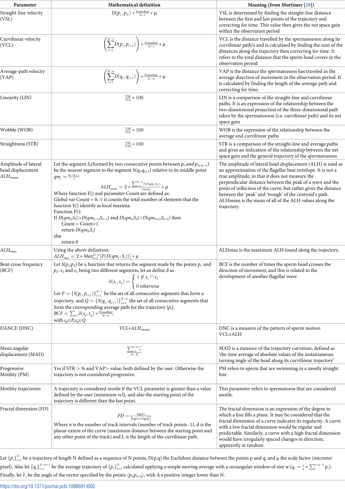

# OpenCASA Sperm Parameters Reference

This document defines the standard Computer-Assisted Sperm Analysis (CASA) parameters used in sperm motility assessment.

## References

1. Alquézar-Baeta, C., Gimeno-Martos, S., Miguel-Jiménez, S., Santolaria, P., Yániz, J., Palacín, I., Casao, A., Cebrián-Pérez, J.Á., Muiño-Blanco, T., and Pérez-Pé, R. (2019). OpenCASA: A new open-source and scalable tool for sperm quality analysis. Plos Comput. Biol. 15, e1006691. <https://doi.org/10.1371/journal.pcbi.1006691>.

2. Yamaguchi, H., Morikawa, M., and Kikkawa, M. (2023). Calaxin stabilizes the docking of outer arm dyneins onto ciliary doublet microtubule in vertebrates. eLife 12, e84860. <https://doi.org/10.7554/eLife.84860>.

3. Xin Zhang, Jiang Sun, Yonggang Lu, Jintao Zhang, Keisuke Shimada, Taichi Noda, Shuqin Zhao, Takayuki Koyano, Makoto Matsuyama, Shushu Zhou, et al. (2021). LRRC23 is a conserved component of the radial spoke that is necessary for sperm motility and male fertility in mice. Journal of Cell Science 134, jcs259381. <https://doi.org/10.1242/jcs.259381>.

* Parameter defination is refer to openCASA: Alquézar-Baeta et al. (2019)

* Zebrafish motile sperm: **VCL > 20 μm/s** (Yamaguchi et al. 2023)

* Mouse motile sperm: **VAP & VSL > 4 μm/s** (Xin et al. 2021)

## Parameter Definitions

