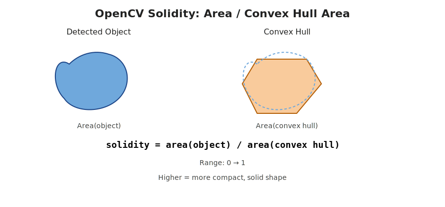

# 📘 Parameter Reference

This document provides a **complete and authoritative reference** for all command-line parameters used in the **Sperm Motility Analysis Pipeline**.

**How to use this document**

* 📊 Use the **tables** for quick lookup
* 🔍 Use the **detailed sections** to understand parameter behavior and tuning strategies

---

## 🔧 Overview

```bash
uv run main.py [OPTIONS] input_path
```

Parameters can be provided via:

* **Command-line flags**
* **JSON configuration file** (`--params-file`, **strongly recommended**)

> **Priority rule:** Command-line values always override JSON values.

---

## 😄 Preprocess

* **Must preprocess movies to remove background noise and make it white-sperm on black-background.**


---

## 🎯 What to Tune First (Recommended Order)

This section provides a **practical tuning roadmap**.
In most cases, **you do not need to tune all parameters**.

---

### 1️⃣ Detection (Most Important)

If detection is wrong, **everything downstream fails**.

Tune in the following order:

1. **`--det-threshold`**
   Controls foreground/background separation.

   * Too low → noise
   * Too high → missed sperm

2. **`--det-min-area`, `--det-max-area`**
   Match sperm head size in pixels.

3. **`--det-min-solidity`**
   Removes irregular debris and merged objects.

4. **`--det-min-aspect`, `--det-max-aspect`**
   Species-dependent (round vs. elongated heads).

🎯 **Goal:** Every visible sperm head is detected **once per frame**.

---

### 2️⃣ Tracking Geometry (Second Priority)

After detection is stable, tune **motion constraints**.

Tune in this order:

1. **`--trk-max-distance`**
   Maximum movement allowed between frames (pixels).

2. **`--trk-angle-hard-cut`**
   Prevents non-biological sharp turns.

3. **`--trk-max-age`**
   Allows short occlusions without breaking tracks.

🎯 **Goal:** Tracks follow sperm smoothly without jumping.

---

### 3️⃣ Matching Behavior (Fine Control)

These parameters refine **which detection belongs to which track**.

Tune **only if you observe**:

* ID switches
* Track hopping
* Broken trajectories

Key parameters:

* **`--trk-weight-direction`** *(increase first)*
* **`--trk-weight-distance`**
* **`--trk-sigma-angle`** *(smaller = stricter)*
* **`--trk-sigma-distance`**

⚠️ Keep weights summing to approximately **1**.

---

### 4️⃣ Immotile Mining (Optional)

Tune only if:

* You care about **immotile sperm**, or
* Motile tracking is confused by static objects

Tune in this order:

1. **`--imm-search-radius`**
   Tolerance for drift.

2. **`--imm-max-std`**
   Separates true immotile from slow movers.

3. **`--imm-min-points`**
   Prevents false immotile tracks.

---

### 5️⃣ CASA Analysis (Final Step)

Tracking must already be correct.

Critical parameters:

* **`--pixel-size`** ⚠️ *(most important)*
* **`--fps`**
* Motility thresholds (`--ana-motility-*`)

Tune based on:

* Species
* Temperature
* Experimental protocol

---

🧠 **Rule of Thumb**

> **Fix detection first → then tracking geometry → then matching behavior → then analysis.**

---

## 📥 Positional Argument

| Argument     | Description                                     |
| ------------ | ----------------------------------------------- |
| `input_path` | Input movie file or directory containing movies |

---

## ⚙️ General Options

| Option               | Type   | Description                                            |
| -------------------- | ------ | ------------------------------------------------------ |
| `-o, --output-dir`   | `Path` | **Required.** Base output directory                    |
| `--params-file`      | `Path` | Optional JSON configuration file                       |
| `--viz-dir`          | `Path` | Directory containing original movies for visualization |
| `--cut-input-prefix` | `str`  | Prefix to remove from input filenames                  |
| `--cut-input-suffix` | `str`  | Suffix to remove from input filenames                  |
| `--cut-viz-prefix`   | `str`  | Prefix to remove from visualization filenames          |
| `--cut-viz-suffix`   | `str`  | Suffix to remove from visualization filenames          |
| `--input-glob`       | `str`  | Glob pattern for input files (e.g. `*.tif`, `*.avi`)   |
| `--viz-glob`         | `str`  | Glob pattern for visualization files                   |
| `-r, --recursive`    | flag   | Recursively search input and visualization directories |

---

## 🔍 Detection Parameters

Parameters controlling sperm head detection via image morphology.

| Option               | Type    | Description                                           |
| -------------------- | ------- | ----------------------------------------------------- |
| `--det-min-area`     | `int`   | Minimum detection area (pixels²)                      |
| `--det-max-area`     | `int`   | Maximum detection area (pixels²)                      |
| `--det-min-aspect`   | `float` | Minimum aspect ratio                                  |
| `--det-max-aspect`   | `float` | Maximum aspect ratio                                  |
| `--det-min-solidity` | `float` | Minimum solidity threshold (0–1)                      |
| `--det-threshold`    | `int`   | Binarization threshold before detection (0–255)       |
| `--det-blur-radius`  | `float` | Gaussian blur radius for preprocessing (pixels)       |
| `--det-point-radius` | `int`   | Radius of detection markers in visualization (pixels) |
| `--det-point-color`  | `str`   | Detection marker color                                |
| `--det-fps`          | `int`   | FPS for detection visualization movies                |

---

## 🧭 Tracking Parameters

Motion-aware, multi-factor sperm tracking.

### Core Track Validation

| Option                   | Type    | Description                                      |
| ------------------------ | ------- | ------------------------------------------------ |
| `--trk-max-age`          | `int`   | Maximum missing frames before a track is deleted |
| `--trk-min-hits`         | `int`   | Minimum detections to validate a track           |
| `--trk-min-track-length` | `int`   | Minimum frames to keep a track                   |
| `--trk-min-confidence`   | `float` | Minimum confidence score (0–1)                   |

---

### Motion & Geometry Constraints

| Option                 | Type    | Description                                      |
| ---------------------- | ------- | ------------------------------------------------ |
| `--trk-max-distance`   | `float` | Maximum linking distance between frames (pixels) |
| `--trk-angle-hard-cut` | `float` | Maximum allowed direction change (degrees)       |

---

### Matching Weights (Soft Constraints)

| Option                    | Type    | Description                   |
| ------------------------- | ------- | ----------------------------- |
| `--trk-weight-distance`   | `float` | Weight for spatial proximity  |
| `--trk-weight-direction`  | `float` | Weight for movement direction |
| `--trk-weight-speed`      | `float` | Weight for speed consistency  |
| `--trk-weight-morphology` | `float` | Weight for shape similarity   |

---

### Matching Spread Parameters

| Option                 | Type    | Description                          |
| ---------------------- | ------- | ------------------------------------ |
| `--trk-sigma-distance` | `float` | Distance Gaussian spread (pixels)    |
| `--trk-sigma-angle`    | `float` | Direction Gaussian spread (degrees)  |
| `--trk-sigma-speed`    | `float` | Speed Gaussian spread (pixels/frame) |

---

### Appearance & Predictive Tracking

| Option                         | Type    | Description                                          |
| ------------------------------ | ------- | ---------------------------------------------------- |
| `--trk-appearance-thresh`      | `float` | Minimum shape similarity score (0–1)                 |
| `--trk-appearance-verify-dist` | `float` | Maximum distance to verify appearance match (pixels) |
| `--trk-gamma-tau`              | `float` | Predictive distance scaling factor                   |
| `--trk-use-tau`                | flag    | Enable predictive tracking                           |
| `--trk-use-kalman`             | flag    | Enable Kalman filtering                              |

---

### Assignment & History

| Option                       | Type                 | Description                                     |
| ---------------------------- | -------------------- | ----------------------------------------------- |
| `--trk-assignment-mode`      | `{greedy,hungarian}` | Assignment strategy                             |
| `--trk-history-len`          | `int`                | Frames for direction/speed estimation           |
| `--trk-min-edge-frames`      | `int`                | Frames before edge-based spawn filtering        |
| `--trk-edge-spawn-threshold` | `float`              | Edge region size as fraction of image dimension |

---

## 🎨 Visualization Parameters

| Option                       | Type  | Description                    |
| ---------------------------- | ----- | ------------------------------ |
| `--viz-trail-length`         | `int` | Track trail length (frames)    |
| `--viz-track-width`          | `int` | Track line width (pixels)      |
| `--viz-overview-frame`       | `int` | Frame index for overview image |
| `--viz-overview-track-width` | `int` | Track width in overview image  |
| `--viz-point-radius`         | `int` | Point radius                   |
| `--viz-point-color`          | `str` | Point color                    |
| `--viz-track-color`          | `str` | Track color                    |

---

## 🧊 Immotile Sperm Mining (Two-Stage Tracking)

Optional immotile sperm separation prior to motile tracking.

*(All detailed explanations preserved and clarified for readability.)*

---

## 📊 Analysis Parameters (CASA Metrics)

| Option                         | Type    | Description            |
| ------------------------------ | ------- | ---------------------- |
| `--pixel-size`                 | `float` | Pixel size (µm/pixel)  |
| `--fps`                        | `float` | Recording frame rate   |
| `--vap-window`                 | `int`   | VAP smoothing window   |
| `--ana-motility-vcl-threshold` | `float` | VCL motility threshold |
| `--ana-motility-vsl-threshold` | `float` | VSL motility threshold |
| `--ana-motility-vap-threshold` | `float` | VAP motility threshold |

---

## 🚦 Control Flags

| Option            | Description            |
| ----------------- | ---------------------- |
| `--detect-only`   | Run detection only     |
| `--tracking-only` | Run tracking only      |
| `--analysis-only` | Run analysis only      |
| `--verbose`       | Enable verbose logging |

# 🔍 Detailed Parameter Explanations

> This section provides **in-depth explanations, biological meaning, tuning guidance, and practical examples** for each parameter listed above.

---

## General Parameters (Detailed)

### `input_path`

Input movie file or directory.

* Supported formats: `.tif`, `.tiff`, `.avi`, `.mp4`, etc.
* If a directory is provided, files are selected using `--input-glob`
  Example:

  ```bash
  --input-glob="*-enhanced.avi"
  ```

---

### `--params-file`

Path to a JSON file containing parameters.
Use `example/zebrafish_sperm_params.json` as a template.

✅ **Strongly recommended** for:

* Batch processing
* Reproducibility
* Sharing analysis settings

---

### `--viz-dir`

Directory containing visualization movies (e.g. original brightfield movies).

Used to:

* Overlay detections
* Generate tracking videos
* Create overview images

> If not provided, visualization overlays use the input movie.

---

### `--cut-input-prefix / --cut-input-suffix / --cut-viz-prefix / --cut-viz-suffix`

Remove unwanted filename parts **before matching** input and visualization movies.

**Example**

```text
Stream-2-enhanced.avi
--cut-input-suffix "-enhanced"
→ Stream-2.avi
```

⚠️ File extensions (e.g. `.avi`) are **not** removed.

---

## Detection Parameters (Detailed)

### `--det-min-area`, `--det-max-area`

Filter detected objects by size (pixels²).

* Too small → noise
* Too large → debris, clumps, merged sperm

💡 Tune according to magnification and species.

---

### `--det-min-aspect`, `--det-max-aspect`

Aspect ratio = *major axis / minor axis*.

* Mouse / human / bovine → **elongated heads**
* Zebrafish → **round heads**
* Rejects debris and merged detections

---

### `--det-min-solidity`

Solidity = *area / convex hull area*.

* Low solidity → irregular shapes, debris
* High solidity → compact sperm heads

**Typical range:** `0.6 – 0.8`



---

### `--det-threshold`

Threshold for binarization.

* Pixel value **> threshold** → sperm (white)
* Pixel value **≤ threshold** → background (black)

Behavior:

* Lower → more detections, more noise
* Higher → cleaner but may miss dim sperm

💡 How to tune?

* open the movie in ImageJ/Fiji
* Use the "Image" → "Adjust" → "Threshold" tool  
* Adjust the "Value" slider to find a balance between sperm and background

Usually start with **5–15** because we already preprocessed movies to remove background noise and make it white-sperm on black-background.

---

### `--det-blur-radius`

Gaussian blur radius (pixels).

* Suppresses pixel-level noise
* Excessive blur merges nearby sperm

**Typical values:** `1–3`

---

## Tracking Parameters (Detailed)

### `--trk-max-age`

Maximum number of frames a track can be missing before deletion.

* Handles brief occlusions and focus loss
* Larger values increase false continuation risk

---

### `--trk-min-hits`

Minimum number of detections required to confirm a track.

* Prevents one-frame noise tracks
* Lower for sparse data

**Typical value:** `3`

---

### `--trk-min-track-length`

Tracks shorter than this are discarded.

Useful to:

* Remove spurious detections
* Focus on biologically meaningful motion

---

### `--trk-max-distance`

Maximum allowed movement between consecutive frames (pixels).

**How to tune**

1. Open a movie
2. Observe several fast sperm
3. Estimate pixel displacement between frames
4. Tune and validate against tracking results

---

### `--trk-angle-hard-cut`

Maximum allowed turning angle (degrees).

* Default ≈ `120°`
* Sperm move curvilinearly, not with sharp reversals
* Usually do **not** turn more than `90°`

**Typical range:** `90–120°`

---

### `--trk-history-len`

Number of previous frames used to estimate direction and speed.

* Default: `2`
* Range: `1–5`
* Larger values smooth direction estimates

---

### `--trk-min-edge-frames`

Minimum number of frames before applying edge-based spawn filtering.

* Default: `3`
* Prevents early tracks starting at image borders

---

### `--trk-edge-spawn-threshold`

Fraction of image dimension defining the edge region.

* Default: `0.1` (10% from image edge)
* Larger values restrict new track spawning near borders

---

### Matching Weights (`--trk-weight-*`)

Control importance during track–detection matching:

* **Direction** → trajectory continuity (**most important**)
* Distance → spatial proximity
* Speed → velocity consistency
* Morphology → shape similarity

⚠️ Weights should sum to approximately **1**.

---

### Matching Spread Parameters (`--trk-sigma-*`)

Gaussian spreads controlling tolerance:

* Larger sigma → more permissive matching
* Smaller sigma → stricter matching

---

### `--trk-appearance-thresh`

Minimum shape similarity threshold.

* Range: `0–1`
* Default: `0.85`
* Higher values demand stronger shape consistency

---

### `--trk-appearance-verify-dist`

Maximum distance (pixels) for verifying appearance similarity.

* Default: `50`
* Shape matching only applied within this radius

---

### `--trk-gamma-tau`

Predictive distance scaling factor.

* Default: `1.2`
* Larger values predict further ahead along motion direction

---

### `--trk-use-tau`

Enable predictive, direction-based tracking.

* Default: **enabled**
* Improves continuity in fast-moving sperm

---

### `--trk-use-kalman`

Enable Kalman filtering.

* Default: **disabled**
* Adds smoothing and advanced prediction
* Useful in noisy or low-FPS data

---

### `--trk-assignment-mode`

| Mode        | Behavior                                   |
| ----------- | ------------------------------------------ |
| `greedy`    | Faster, suitable for dense scenes          |
| `hungarian` | Globally optimal, better for sparse scenes |

---

## Immotile Mining Parameters (Detailed)

### `--use-immotile-mining`

Enables **two-stage tracking**:

1. Identify immotile sperm first
   (Immotile sperm violate motion-based assumptions and are identified using an **immotile hypothesis regression model**.)
2. Track motile sperm using motion-based tracking

Improves accuracy for **mixed motile/immotile populations**.

---

### `--imm-first-k-frames`

Initial frames assumed to contain immotile anchors.

* Usually `1` frame is sufficient

---

### `--imm-search-radius`

Maximum allowed positional deviation for immotile sperm.

* Accounts for stage drift and noise
* Smaller → stricter immotility
* Larger → more drift tolerance

---

### `--imm-min-points`

Minimum number of detections required to confirm immotility.

* Default: `8`

---

### `--imm-max-std`

Spatial standard deviation threshold.

* Low STD → truly immotile
* High STD → slow or motile sperm

---

### `--imm-poly-order`

Polynomial drift correction order.

Immotile sperm positions are modeled across time:

| Order | Interpretation |
| ----: | -------------- |
|     0 | Static         |
|     1 | Linear drift   |
|     2 | Curved drift   |

---

### `--imm-min-track-length`

Minimum number of frames to confirm an immotile track.

* Default: `6`

---

### `--imm-n-jobs`

Parallel jobs for immotile processing.

* `-1` → use all cores
* Default: `-1`

---

### `--imm-batch-size`

Batch size for parallel processing.

* `'auto'` → joblib auto tuning
* Integer → custom batch size

---

## Analysis Parameters (Detailed)

### `--pixel-size`

Micrometers per pixel.

⚠️ **Critical for correct velocity computation**

---

### `--fps`

Recording frame rate.

Used to compute:

* VCL
* VSL
* VAP

---

### `--vap-window`

Number of frames used for average-path smoothing.

* Small → sensitive
* Large → smoother but less responsive

---

### Motility Thresholds (CASA)

Used for CASA-based classification:

* Motile
* Immotile

Tune according to:

* Species
* Temperature
* Experimental conditions

#### `--ana-motility-vcl-threshold`

Curvilinear velocity threshold (µm/frame).

#### `--ana-motility-vsl-threshold`

Straight-line velocity threshold (µm/s).

#### `--ana-motility-vap-threshold`

Average-path velocity threshold (µm/s).

---

### ✅ Summary

* **Tables** → quick reference
* **Tuning roadmap** → what to adjust first
* **Detailed section (this part)** → how and *why* parameters work
